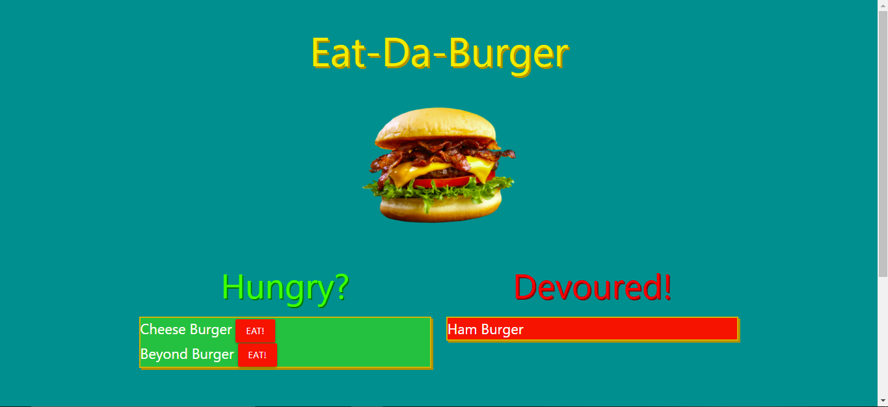
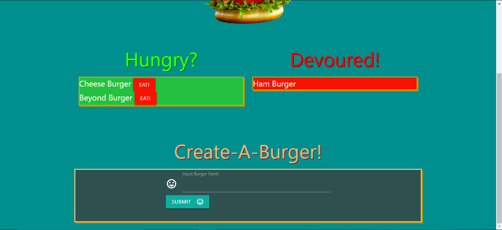
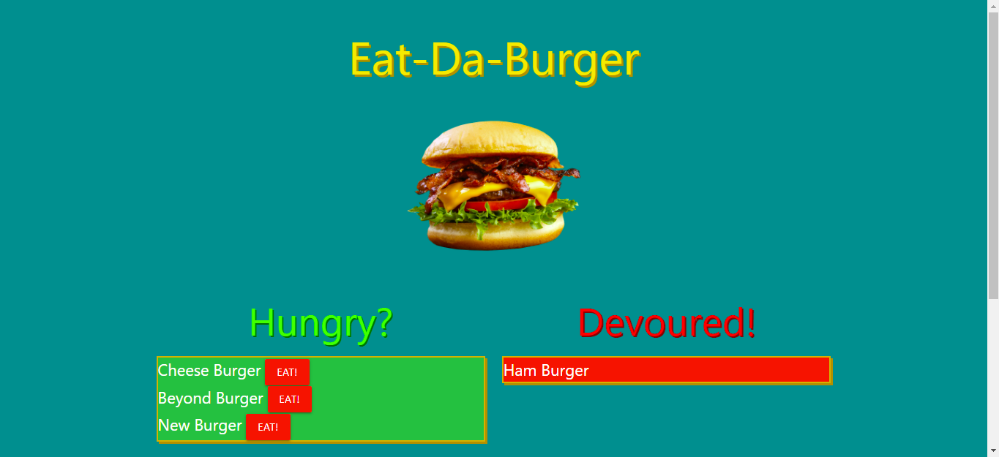
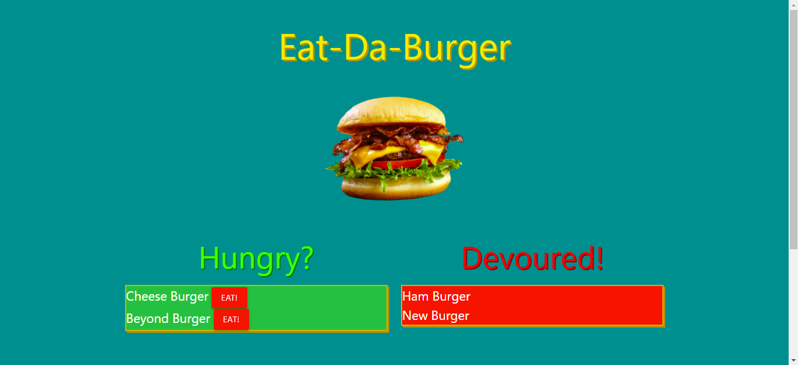
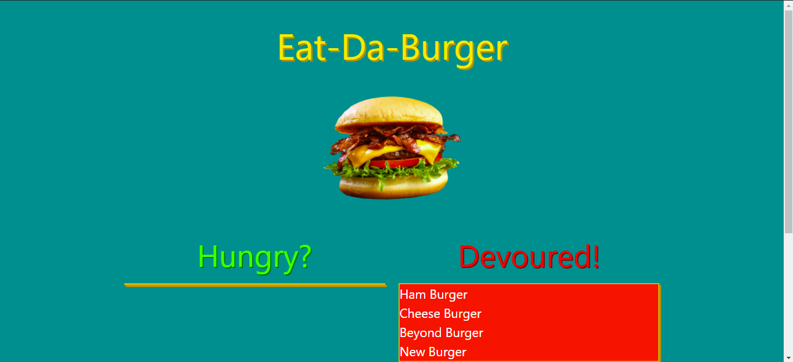

# Handlebars Burger

## Table of Contents
- [Description](#description)
- [Features and Layout](#features-and-layout)
- [Technology Used](#technology-used)
- [Goals](#goals)
- [Authors](#authors)

## Description
This web application allows for input of a new burger, that will then go into the "Hungry?" column and once the "Eat!" button is clicked the burger is then placed inside of the "Devoured!" column. This is an attempt at learning the Model View Controller pattern. The application uses express for the routing and express-handlebars which is a template engine for express that calls for the use of handlebars templating language. Handlebars is used to make the HTML layout of the application. SQL is used to insert, update, and get the data, then it goes through an object-relational mapping (ORM) tool made with node so that the data can be used for the layouts.

## Features and Layout
- Eat-Da-Burger landing page shows two columns one named "Hungry?" the other named "Devoured!"

- The bottom of the landing page which allows the user to input a new burger into the "Hungry?" column.

- A closer look at the input form for creating a new burger, in this example "New Burger" is inputted.

- Once "New Burger" is submitted it now shows up in the "Hungry?" column.

- When clicking the red "Eat!" button the "New Burger" moves over into the "Devoured!" column.

- All red "Eat!" buttons were clicked and now they all appear in the "Devoured!" column

## Technology Used
- HTML
- CSS
- Materialize
- Google Fonts
- JavaScript
- SQL
- jQuery
- Node.js
- Express.js
- Express-Handlebars

## Goals
The main goal of this project was to learn more about the express-handlebars template engine along with object-relational mapping (ORM) using JavaScript and SQL. These goals were accomplished though I do want to work more with a SQL and JavaScript ORM in order to better understand them together.

## Authors
- Jack Ceballos
